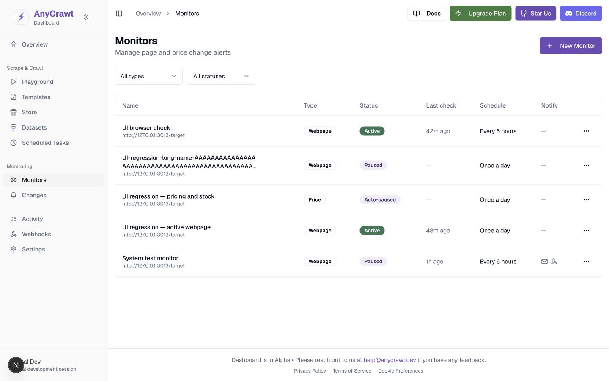
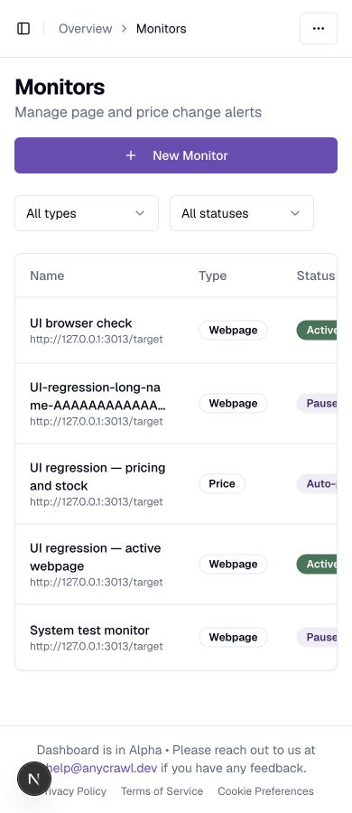

# Web Change Monitoring 修复与验收

日期：2026-09-06。范围：此前审查的 R01–R24、U01–U14、DEV-01。实现沿用现有数据库、BullMQ、抓取引擎、API/BFF 和设计组件；没有部署、提交或重放生产历史告警。

## 修复结果

| 审查项 | 已落实的修复 | 主要证据 |
| --- | --- | --- |
| R01 | Webhook 使用完整 OwnerContext；有 user 按 user，无 user 按 API key；开启鉴权时拒绝空 owner | Webhook owner 6 用例，真实隔离 API 的跨 owner 404 |
| R02、R03 | SQLite 同步事务步骤与 PG 独立连接事务；ORM 编码日期；移除 PG 专属查询；修复 SQLite 历史迁移缺口 | 双 DB 真实事务、完整迁移、CRUD、计费和分进程链路 |
| R04、R05 | execution 终态与 ready 意图原子提交；Redis 入队前关联 job/execution/check；DB 扫描恢复后处理 | 实际杀死 Scheduler/处理进程后，抓取完成保留 ready，重启恢复 completed |
| R06、R07 | 单监控活跃检查唯一约束，跨抓取及后处理串行；queue 延后，manual 去重；monitorManaged 不计普通任务配额 | 两个真实 scheduler jobs 顺序完成、并发 manual 单飞、额度 1 下多个 monitor 不被误停 |
| R08、R09、R10 | 文本与 JSON 独立比较；完整正文保存，API 预览单独截断；无效首次抽取不能建基线；旧不完整内容排除 | 28 个比较/意图准备回归、300000+ 字符完整基线、长尾变化、首次全 null/合法空数组 |
| R11、R12、R13、R14 | 在事务中读取当前配置后合并 PATCH；校验最终 recipients/schema；null 清除；同步 task payload/credits/name/tags/metadata；拒绝未知顶层字段 | 双 DB 并发 PATCH、失败回滚、实际读写与删除；9 个有效配置单元回归 |
| R15、R16 | 固定国家出口明确不支持，新 country 请求返回 400；表单、公开页面与示例不再声称地域锁定；ignore_selectors 明确为字面文本行排除 | UI/内部及 EN/ZH 文档一致；5 个公开创建样例用实际 Schema 验证通过，浏览器确认主价格页含 recipients 和不可固定地域说明 |
| R17、R18 | 检查/变化与通知意图一起持久化；Email 按收件人重试；稳定 Message-ID/Delivery-ID；pending/retrying 队列恢复；实际 SMTP/HTTP 成功才计 notified | 双 DB × 真实 Redis/SMTP/HTTP，各 4 个集成用例；包含 451→成功、500→200、部分/全拒收及缺失队列 job 恢复 |
| R19 | AI 同时收到文本和结构化差异；输入不完整/服务不可用标 meaningful=null；保留变化证据；不做隐藏二次抽取 | 比较测试及真实 judge 函数的 3 个边界测试（外部 AI I/O mock） |
| R20 | 未编辑 schema 不重构；复杂结构用原始 JSON 编辑器；保留 mixed；JSON Schema 保留 required/enum/additionalProperties 等键 | RTL 往返测试、实际浏览器保存后 DB 确认 mixed 和嵌套约束均保留 |
| R21 | 有效状态统一为 is_active && !is_paused；自动暂停直接 resume；409 code 分流；刷新检查状态不覆盖草稿，失败不报成功 | 自动暂停组件回归、浏览器创建→new 基线、真实暂停检查返回 MONITOR_PAUSED |
| R22 | 可见页轮询/焦点刷新、显式刷新、请求取消与代次隔离；稳定游标；展开时取 diff；跨页新增过多时明确重置到连续首屏 | 3 个乱序/游标/刷新失败回归，浏览器 50→57 条无重复 |
| R23 | 价格按 URL/path/currency 分系列；未知货币只显示独立点；说明仅含已加载变化点 | 多系列单元回归；浏览器 USD 33 点 / EUR 17 点分别选择 |
| R24 | SDK 补快照详情、owner feed、游标页、检查/通知历史；补 nullable PATCH 和具体响应类型；同步文档 | SDK 129 tests、build；公开文档 330 个页面构建 |

检查表/通知表的具体实现见 [MonitorWorkflow](../../packages/db/src/model/MonitorWorkflow.ts)、[MonitorManager](../../packages/scrape/src/monitor/MonitorManager.ts)、[配置事务](../../packages/db/src/model/MonitorConfiguration.ts)、[比较处理器](../../packages/scrape/src/monitor/MonitorPostProcessor.ts)。

## UI 样式、语义与焦点

| 审查项 | 修复与验证 |
| --- | --- |
| U01、U02 | 单一 Tailwind reset；修复暗色 primary foreground、Active 徽章、delta 等颜色；主题边框不再被第二次 preflight 覆盖 |
| U03–U06 | 窄屏 header 折叠；标题、hash、骨架可收缩；快照抽屉无整层溢出；列表极长名称显示两行 |
| U07、U08 | 标签关联输入；动态字段、选择器、图标按钮有名称；类型卡片有 pressed 语义 |
| U09、U11 | 面包屑真实 href 并可 Enter 导航；监控链接和 diff 按钮独立，aria-expanded/aria-controls 正确 |
| U10、U12、U13 | Snapshot Escape→View；删除 Cancel→原按钮；向导首错聚焦输入、换步回标题；手机导航有名称/关闭按钮且导航后关闭；公开页头也改为窄屏菜单和单一链接交互 |
| U14、DEV-01 | 主价格页及 SEO 示例补 recipients；dev project UUID 合法；显式 dev 分支不挂载远端 SDK，production 即使设置 dev flag 也不能绕过鉴权 |

最终列表在 **320/390/768/820/1024/1440px × Light/Dark** 均已读取页面宽度：scrollWidth 等于视口宽度；表格允许局部横向滚动。长标题详情与加载完成的 Snapshot 抽屉在 390px 未撑宽。共享 Webhooks 页面在 768px 暗色下也为 768px，覆盖共享 header/边框变化。

实际 CSS 颜色计算的普通文字对比度：Light 主按钮 **6.47:1**，Dark 主按钮 **7.28:1**，Active 徽章 **5.48:1**，Light 正/负 delta **6.47:1 / 5.48:1**。数据见 [UI measurements](./assets/monitoring-fixes-2026-09-06/ui-metrics.json)。

浏览器合成数据仅用于覆盖长标题、复杂 schema、旧状态和大量历史的视觉场景；与真实抓取/投递链路结果分别记录，不把合成价格数据当作实际 LLM 抽取结果。

其余截图位于 [验收资源目录](./assets/monitoring-fixes-2026-09-06/)，包含完整主题/尺寸矩阵、长标题、Snapshot、向导错误/换步、手机侧栏、字段 diff、价格图及共享页面。

## 自动化与真实依赖验证

| 验证 | 结果 |
| --- | --- |
| libs 全套 | 103 通过 |
| db 全套（包含严格迁移和 native SQLite 事务） | 118 通过 |
| scrape 全套 | 183 通过；原有 2 个 opt-in smoke suites / 3 tests 保持跳过，没有新增 skip |
| 后续受影响的比较、judge、Scheduler、Webhook 回归 | 42 通过 |
| 双 DB 工作流集成 | SQLite 13 / PostgreSQL 13 通过，含真实计费幂等/并发 |
| 双 DB 通知集成 | SQLite 4 / PostgreSQL 4 通过，真实 Redis、SMTP、HTTP |
| JS SDK 全套 | 129 通过 |
| Dashboard 全套 | 119 通过 |
| 后端 libs/db/scrape/api/SDK 构建 | 通过 |
| Dashboard production build | 使用根目录现有配置通过；最终文案/历史提示修改后同命令再次通过 |
| 公开 docs | frontmatter、typecheck、production build 通过，330 页面生成 |
| 公开创建示例 | 5 个通过实际 createMonitorSchema |
| 分进程系统验证 | 双 DB 通过，均含 6 个完成检查、queue、真实 Worker 崩溃恢复、owner、额度、删除和历史状态暂停保护 |

分进程证据：[SQLite](./assets/monitoring-fixes-2026-09-06/system-sqlite.json)、[PostgreSQL](./assets/monitoring-fixes-2026-09-06/system-postgresql.json)。运行器：[system-harness.mjs](../../scripts/monitoring/system-harness.mjs)。

**未宣称通过的部分：** API 包原有 3 个 live suites / 20 tests 依赖固定 `127.0.0.1:8080`，以及外部抓取、浏览器、搜索或 LLM 服务。首次沙箱连接 EPERM；获准联网后对 8080 的只读 health 请求仍超时。这些用例未改成 mock，也没有用本轮隔离监控结果替代；同次 API 全套另有 66 通过、原有 17 live tests 按原开关跳过。真实第三方登录回跳和外部 AI 服务质量也不属于本次已完成的本地验证。

## 迁移与运行

新增迁移：

- PostgreSQL：`0026_monitor_workflow.sql`。
- SQLite：`0021_monitor_workflow.sql`、`0022_repair_sqlite_job_billing.sql`。
- 已应用的历史 SQL 保持原样。SQLite 0009/0010 重复添加 charge_details 的问题由迁移执行器精确识别：只有已存在的 nullable TEXT 定义完全一致才允许该已知重复步骤；其他 DDL 错误仍回滚并失败。
- SQLite 的 jobs.deducted_at 在原历史中缺失，0022 明确补齐；真实 billing 回归已覆盖该列。

发布时先停止/排空旧监控 producer，再备份并迁移目标 DB，随后一起启用新 API/Scheduler/Worker；不要让新旧后处理实现同时消费监控。`pnpm --filter @anycrawl/db db:migrate` 和容器的 `db:migrate:docker` 使用同一迁移执行逻辑。新恢复处理随 scheduler 启动，也可用 `--queues=monitor` 单独运行。

历史截断正文无法恢复，旧 notified 无法逆推出送达。纯暂停不受旧配置无效的阻碍；恢复仍须通过配置校验。Scheduler 会暂停缺少 monitor 记录或与 inactive monitor 不一致的历史任务，阻止隐藏执行。升级不会补发历史告警，旧快照保留但不用于新完整基线。配置变化生成新 revision，旧检查晚到只保留原版本记录。通知为可恢复的至少一次尝试，接收端可用稳定 ID 去重；不承诺 SMTP exactly-once。

全文存储与预览配置独立：默认比较上限 2000000 字符，预览 262144 字符。保留期默认 0；启用后仍保护当前健康基线、保留的 change 引用、待发送意图、部分送达但仍有待重试 Webhook 的记录，以及 legacy 历史。保留策略不等于严格磁盘容量上限。

回退时停止新 producer 并保留新表/意图；不要直接删除新增表或让旧 Worker 重放新格式任务。单目标、字面文本行过滤、国家出口不支持等边界保持明确。

## 本地复验

数据库集成从 `packages/db` 执行 `jest --config jest.integration.config.mjs`；通知集成从 `packages/scrape` 执行同名配置。必须显式设置隔离测试 DB/Redis，脚本会拒绝不匹配的连接。

Dashboard 构建使用现有配置：从 `apps/web` 执行 `NODE_ENV=production pnpm exec dotenvx run -f ../../.env -- next build`。普通 next build 不会自动读取 monorepo 根 .env；本次没有改用测试 project ID 冒充生产配置。

开发登录设置 `ANYCRAWL_DASHBOARD_DEV_AUTH=1`，仅在非 production 生效；API 地址及 key 仍须在服务端配置。它提供本地开发身份，不创建真实登录会话。截图回归使用了独立源码副本和临时 API/SMTP/HTTP/Redis/DB，不接触既有 SourceWeft 服务。

## Docs consulted

- [完整审查](./web-change-monitoring-review-2026-09-06.md)
- [UI 审查](./web-change-monitoring-ui-review-2026-09-06.md)
- [修复计划](./web-change-monitoring-fix-plan-2026-09-06.md)
- [Monitors API](../api/monitors-api.md)
- [Dashboard Guide](../api/monitors-dashboard-guide.md)
- [Execution Lifecycle](../scheduled-task-execution-lifecycle.md)
- [Scheduled Tasks API](../api/scheduled-tasks-api.md)
- [Webhooks API](../api/webhooks-api.md)
- [Cache](../cache.md)
- [AI config](../ai-config.md)
- [Jest config](../jest-config-guide.md)
