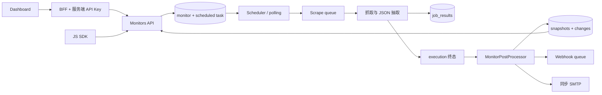

# Web Change Monitoring 完整审查报告

审查日期：2026-09-06。状态：**审查完成，尚未修复**。

本报告配套 [修复计划](./web-change-monitoring-fix-plan-2026-09-06.md) 与 [UI 专项审查及截图](./web-change-monitoring-ui-review-2026-09-06.md)。审查仅更新文档和截图资产，没有修改原仓库的实现、测试、依赖、迁移或运行配置，没有提交代码。UI 运行使用经用户授权的临时副本、开发登录和只读模拟数据。

文件已保存到工作区；当前 `.gitignore:70` 的 `/docs/` 规则忽略本目录，因此文档尚未进入版本控制。本轮没有修改忽略规则或强制暂存文件。

## 1. 范围、基线与证据分级

审查对象是当前工作区中的 Webpage / Price Monitors，包括其依赖的调度、抓取完成回调、数据库、Webhook、Email、JS SDK 和 Dashboard；不是仅审查最近几个 diff。

| 仓库 | 审查基线 | 本次覆盖的工作区变更 |
| --- | --- | --- |
| AnyCrawl（下文 B） | `ea6d0d92785f3a1686788c399f0dc05f43075bb8` | MonitorController PATCH、跨监控 change feed、MonitorSchema、AI 抑制后的状态修正，以及相关浏览器 humanize 改动 |
| AnyCrawlDashboard（下文 D） | `7ec86c11f5421116632c2bc57766def642ec23c2` | Changes 页面/BFF/client/mapper、导航与面包屑 |

同时追踪了 `927ea1d` 的监控可靠性修复、`8d62d1e` 的 Dashboard 修复，以及最近的 SQLite 迁移补齐。与监控无直接关系的模板、Dataset 导出和其他未提交业务代码不作完整功能审计。Dataset 的 Changes 与 Monitor 的 Changes 是两套独立实现，不能把前者的 reconciliation 能力算作后者已经完成。

证据等级：

- **E1 本轮运行复现**：运行现有测试、无输出文件的类型检查，或在内存中执行当前代码/实际依赖的诊断。
- **E2 上轮运行复现，本轮复核源码**：上一轮临时 Jest 用例已移除；本轮没有重新创建测试文件。
- **E3 代码路径确认**：触发条件、分支和后果可由源码追踪，但没有进行真实 DB/Redis/浏览器并发或故障注入。
- **O 观察/验收缺口**：需要环境数据或产品语义才能下最终结论，不计为已确认功能缺陷。

严重性：P1 为租户数据隔离、支持部署不可用或关键结果丢失；P2 为特定输入/故障条件下的错误行为；P3 为接口完整性和文档维护问题。优先级不代表已经测得生产发生频率。

## 2. 总体结论

**主要功能入口已经落地，但当前实现还不能按“可靠的持续监控闭环”验收。** 本文的实现链路审查发现 24 项问题：5 项 P1、18 项 P2、1 项 P3。P1 中 SQLite 问题以使用 SQLite 部署为前提，租户隔离问题以 API-Key-only owner 为前提。

后续已完成实际 Chrome UI 审查，另记录 **14 项 UI/交互问题（12 项 P2、2 项 P3）与 33 张截图**，详见 [UI 专项](./web-change-monitoring-ui-review-2026-09-06.md)。包含暗色对比度/边框、平板 header 溢出、手机 hash/长名称/骨架溢出、表单标签和焦点、侧栏及展开交互。UI 与部分实现问题有交叉，数量不直接相加当作去重总数。

最重要的问题不是缺少页面，而是：

1. API-Key-only 监控事件可能投递给其他所有者。
2. SQLite 的事务调用方式及 SQL/参数编码与当前驱动不兼容。
3. execution 终态与监控后处理之间没有可靠的补偿和重放机制。
4. 文本 hash 提前返回会漏掉实际 JSON 字段变化。
5. 配置、通知状态和 Dashboard 展示仍可能偏离实际执行。

现有测试通过不等于上述路径已验收：监控测试 mock 了 DB、Webhook、Email 和 AI 边界，无法验证真实事务、SQL 方言、队列投递和多进程顺序。

## 3. 实现覆盖情况

| 能力 | 当前实现 | 审查结论 |
| --- | --- | --- |
| 创建/列表/详情/修改/删除 | API、BFF、Dashboard 均有入口；创建时同时写 backing task 和 monitor | 已实现，受 R02、R11–R14 影响 |
| Cron 与时区 | 五字段 cron、15 分钟下限、IANA 时区校验；BullMQ scheduler 与 DB polling | 已实现；不是“创建 API 成功即调度已可靠建立” |
| 手动首检与 `/check` | 创建后尝试首检；消费者探测；10 秒桶 job ID；202/409/503 | 已实现，受 R05–R07、R21 影响 |
| 真正抓取完成后处理 | Base / Progress → finalizeExecution → MonitorPostProcessor | 已接通，受 R04–R06 影响 |
| 基线与快照 | 首次 `new`；成功快照作为后续基线；错误快照被排除 | 已实现，受 R08–R10 影响 |
| 文本差异 | 归一化、SHA-256、行 diff、比例过滤、LCS 大小保护 | 已实现；完整文本检测与内联截断尚未正确分离 |
| JSON/价格差异 | 复用 `data.json`、字段递归 diff、价格/库存分类与百分比阈值 | 已实现，受 R08、R10、R19 影响 |
| AI 判断 | goal 存在时判定；不可用时按 meaningful 放行并记录低置信度原因 | 已实现；该降级是现有行为，是否继续保留见计划 D4 |
| Webhook | monitor 事件、HMAC、投递记录、重试 | 已接通，受 R01、R03、R17 影响 |
| Email | SMTP 变更摘要、HTML 转义、部分/全部拒收处理 | 已接通，受 R12、R18 影响 |
| Dashboard | 列表、详情、设置、快照详情、diff、价格图、跨监控 feed | 已实现，受 R16、R20–R23 及 UI 专项 U01–U13 影响；实际视觉覆盖见 UI 矩阵 |
| SDK | Monitors CRUD、pause/resume/check、快照列表、change 列表/详情 | 不完整，见 R24 |
| 多目标/站点监控 | `targets` 接受多项，但仅调度第一项 | 文档明确的 MVP 限制；不当作本轮新增回归 |
| 地区固定 | Schema/UI 可以配置 `location.country` | 仅存储，没有连接抓取出口，见 R15 |
| CSS 排除 | 实际删除包含给定字符串的文本行 | 不是 DOM/CSS selector 排除，见 R16 |
| 全量审计与恢复 | 无独立 monitor check 状态、可靠后处理队列或 Email outbox | 关键缺口，见 R04、R18 |

当前主链路：



## 4. 详细发现

### R01 — P1：API-Key-only 监控的 Webhook 缺少所有者隔离

**证据 E2；既有实现。** [Webhook.ts:115](../../packages/scrape/src/managers/Webhook.ts#L115)、[MonitorPostProcessor.ts:523](../../packages/scrape/src/monitor/MonitorPostProcessor.ts#L523)。

API Key 的 `user` 字段允许为空；API 读取时支持以 API Key 隔离，但通知只传 `monitor.userId`。`triggerEvent` 在 `userId` 为空时不执行所有者过滤，从所有匹配事件的订阅中继续按 scope 分发。

触发：Key A 创建无 userId 的 monitor，另一个所有者 B 有 `scope=all` 的 `monitor.changed` 订阅。A 的 diff 会进入 B 的投递记录。上一轮 mock 复现得到 1 条跨所有者投递，没有发送真实请求。

修复方向：事件分发接收完整 OwnerContext；用户所有权与 API-Key-only 所有权使用一致的规则。空 owner 不能隐式意味着“全部租户”，auth-disabled 的单租户行为必须显式定义。

### R02 — P1：SQLite 不支持当前异步 transaction callback

**证据 E1；既有实现，本轮新增发现。** [MonitorController.ts:112](../../apps/api/src/controllers/v1/MonitorController.ts#L112)、[Scheduler.ts:665](../../packages/scrape/src/managers/Scheduler.ts#L665)、[DB 初始化](../../packages/db/src/db/index.ts)。

SQLite 使用 `drizzle-orm/better-sqlite3`，但创建、删除 monitor 和创建 execution 使用 `db.transaction(async tx => ...)`。实际安装的驱动在内存库中抛出：`Transaction function cannot return a promise`。更严重的是，异步回调中的写入仍可能在报错之后继续执行；本轮诊断在错误后查到了两条写入。

影响：API 报错与数据库部分/延迟写入并存；调度 execution 记录的原子性也不成立。最近补表迁移不会修复此问题。

修复方向：建立与两个驱动匹配的事务执行接口。不能仅删除外层 await，也不能捕获错误后返回成功；需验证成功提交与中途失败回滚。

### R03 — P1：SQLite 下调度日期参数和 Webhook SQL 均不兼容

**证据 E1；上一轮 Webhook 问题扩展。** [Scheduler.ts:1607](../../packages/scrape/src/managers/Scheduler.ts#L1607)、[Webhook.ts:108](../../packages/scrape/src/managers/Webhook.ts#L108)、[Webhook.ts:399](../../packages/scrape/src/managers/Webhook.ts#L399)。

当前代码直接在 raw SQL 中插入 `Date`，绕过 SQLite timestamp 列编码；实际驱动报 `SQLite3 can only bind numbers, strings, bigints, buffers, and null`。Webhook 的 `::jsonb @>` 报 `unrecognized token: ":"`，重试查询的 `NOW()` 报 `no such function: NOW`。

影响覆盖 polling、过期/执行查询、通知初次分发及重试，不能把 SQLite 支持视为“迁移建表即可”。

修复方向：比较日期优先使用带列 encoder 的 ORM 条件；JSON containment 使用方言对应表达式；系统性检查本链路中的 raw SQL。保留 SQLite/PostgreSQL 双支持，不静默替换数据库。

### R04 — P1：execution 终态已提交，后处理失败后无法可靠重放

**证据 E3；既有实现。** [ExecutionLifecycle.ts:76](../../packages/scrape/src/managers/ExecutionLifecycle.ts#L76)、[ExecutionLifecycle.ts:160](../../packages/scrape/src/managers/ExecutionLifecycle.ts#L160)、[MonitorPostProcessor.ts:56](../../packages/scrape/src/monitor/MonitorPostProcessor.ts#L56)。

终态更新、任务统计、快照/change 和通知不是一个可恢复流程。只有 `transitioned=true` 才调用后处理；读取结果、写 change 或进程在这期间失败后，再调用 finalize 得到 `transitioned=false`，不会补做。后处理大多捕获并记录异常，execution 仍显示 completed。

还有两个具体窗口：终态已写、任务统计更新失败，会跳过后处理且无法补统计；新 snapshot 已写、change 插入失败，会提前推进基线，下一次检查可能再也看不到该变更。

修复方向：保留 execution 终态幂等约束，另建持久化 monitor check/postprocess 状态和可重试任务；snapshot、change、通知意图需要原子落地。不能通过“把 completed 改回 running”重试。

### R05 — P2：jobUuid 在入队之后关联，快速完成时会漏处理

**证据 E3；上一轮发现保留，未声称已做多进程复现。** [Scheduler.ts:707](../../packages/scrape/src/managers/Scheduler.ts#L707)、[Scheduler.ts:1176](../../packages/scrape/src/managers/Scheduler.ts#L1176)、[Base.ts:1514](../../packages/scrape/src/engines/Base.ts#L1514)、[MonitorPostProcessor.ts:139](../../packages/scrape/src/monitor/MonitorPostProcessor.ts#L139)。

`triggerJob()` 先将抓取 job 入队，返回后才写 `task_executions.jobUuid`。如果抓取完成早于关联写入，Worker 调用 finalize 没有传 jobUuid，后处理读到空值后退出。之后无条件补关联能修复记录关联，却不会重新触发已经跳过的快照/diff。

修复方向：入队前持久化 job 与 execution 的关联，并由可靠后处理机制覆盖崩溃和重试窗口。

### R06 — P2：queue 模式没有按监控串行，manual 还绕过 skip

**证据 E3；既有实现。** [Scheduler.ts:590](../../packages/scrape/src/managers/Scheduler.ts#L590)、[WorkerManager.ts:27](../../packages/scrape/src/managers/Worker.ts#L27)、[MonitorAccess.ts:94](../../packages/db/src/model/MonitorAccess.ts#L94)。

文档定义 queue 为等待前一次执行完成。实现只是“不检查 running”，随后直接派发；scheduler worker 的并发度为 50，派发结束也不等抓取结束。manual 分支绕过 skip；API 的 in-flight 查询与 worker 创建 execution 之间没有原子占位，跨 10 秒桶的并发请求也可能同时通过。

影响：同一 URL 的两次抓取可能并行读同一基线，或较旧的请求晚完成后覆盖较新基线，出现重复/反向变化和重复计费。10 秒桶只减少请求突发，不能保证单监控单飞。

修复方向：以 monitor/task 为键实现可续租、可恢复的执行串行或 claim；manual、cron、catch-up 使用同一准入规则。配置变更期间也应固定每次检查所用的配置版本。

### R07 — P2：后台配额检查仍会暂停 monitor-managed 任务

**证据 E3；既有实现。** [ScheduledTasksController.ts:80](../../apps/api/src/controllers/v1/ScheduledTasksController.ts#L80)、[Scheduler.ts:2003](../../packages/scrape/src/managers/Scheduler.ts#L2003)。

API 列表和创建配额已过滤 `metadata.monitorManaged`，但 `enforceSubscriptionLimits()` 仍统计全部 active task，随后暂停超限的新任务。开启 `ANYCRAWL_SCHEDULED_TASKS_LIMIT_ENABLED=true`，一个额度为 1 的 owner 创建多个 monitor 后，后台仍可暂停这些监控。

修复方向：创建、展示和后台 enforcement 共用相同的普通任务计数规则；monitor 独立额度如需引入，应另行定义，不能通过旧任务配额隐式实施。

### R08 — P1：相同文本 hash 会屏蔽 JSON / mixed 字段变化

**证据 E2；既有实现。** [MonitorPostProcessor.ts:285](../../packages/scrape/src/monitor/MonitorPostProcessor.ts#L285)、[MonitorPostProcessor.ts:335](../../packages/scrape/src/monitor/MonitorPostProcessor.ts#L335)。

是否继续 diff 只取决于文本 hash。复现输入：Markdown 一样，`json.price` 从 19 变为 24；json 和 mixed 两种模式都产生零 change，却已经存储新 JSON 基线。HTML 抽取等场景中 JSON 完全可能变化而 Markdown 不变。

现有名为“mixed mode ... json-only changes”的测试人为使用 `OLD_HASH`，并未覆盖相同全文 hash。

修复方向：text/json/mixed 各自有明确比较条件；json 字段比较不能被文本相等短路；mixed 取两类比较结果的组合。

### R09 — P2：存储截断被误当作比较边界，长页面尾部漏报

**证据 E2；既有实现。** [MonitorPostProcessor.ts:348](../../packages/scrape/src/monitor/MonitorPostProcessor.ts#L348)、[normalize.ts:92](../../packages/scrape/src/monitor/normalize.ts#L92)。

全文 hash 不同，但前 262144 字符相同时，截断内容的 textDiff 返回无变化，状态被改回 same。30 万字符的共同前缀加不同尾部已复现零 change。单纯增加内联上限只移动漏报边界。

修复方向：完整比较数据与界面预览分别存储；截断/读取失败需要显式可观察，不能当作 same。历史已截断快照无法恢复丢失的正文，需安全重建基线。

### R10 — P2：首次无效抽取被当作健康基线

**证据 E2；既有实现。** [MonitorPostProcessor.ts:301](../../packages/scrape/src/monitor/MonitorPostProcessor.ts#L301)、[normalize.ts:27](../../packages/scrape/src/monitor/normalize.ts#L27)。

抽取失败保护以“上一快照有有效 extracted”为前提。首次 `{price:null}` 或空对象被记录为 new，持续失败还可能显示 same。恢复后的有效值也可能被误认为字段新增，而不是第一次有效基线。

同一入口对成功状态但无可用正文的 text 结果也缺少质量区分；空白页面是否为真实变化应由明确规则决定，不能和提取失败混用。

修复方向：先判断采集/抽取是否有效，再建立基线和比较；保留失败原因。空值、空数组、合法的“无库存/无列表结果”与抽取失败要有可测试的约定。

### R11 — P2：PATCH 的 effective config 与 backing payload 不一致

**证据 E2 + E3；部分来自本次未提交合并改动。** [MonitorController.ts:293](../../apps/api/src/controllers/v1/MonitorController.ts#L293)、[MonitorController.ts:372](../../apps/api/src/controllers/v1/MonitorController.ts#L372)。

已复现：原 `only_main_content=false`，只 PATCH `min_change_ratio`，monitor 记录保留 false，但 buildTaskPayload 接收的是 PATCH 片段，实际任务恢复默认 true。

相关代码路径：`goal:null` 已写入 monitor，但 `validated.goal ?? monitor.goal` 又把旧 goal 放回抽取 prompt；`target.options.only_main_content` 也会覆盖 diff_options 的同名值。设置页显示和实际采集参数可能不一致。

修复方向：先生成单一 effective config，再用于校验、monitor 存储、task payload 和 credits 估算；以“字段是否提供”区分 omitted 与 null。明确两处选项的优先级。

### R12 — P2：通知 PATCH 的合并和校验没有使用同一份配置

**证据 E2；本次未提交合并改动相关。** [MonitorController.ts:299](../../apps/api/src/controllers/v1/MonitorController.ts#L299)、[MonitorSchema.ts:274](../../packages/libs/src/types/MonitorSchema.ts#L274)。

两个已复现场景：已保存收件人时仅启用 email 仍返回 400；email 已启用时仅清空 recipients 却返回 200，之后无邮件发送。Schema 在读取旧记录之前校验 PATCH 片段，无法验证最终合并结果。

修复方向：片段结构校验之后，在 owner 校验完成并读取旧记录后验证 effective notify options；BFF 的规则同步对齐。

### R13 — P2：更新、暂停和恢复的两张表不是原子操作

**证据 E3；既有实现。** [MonitorController.ts:327](../../apps/api/src/controllers/v1/MonitorController.ts#L327)、[MonitorController.ts:469](../../apps/api/src/controllers/v1/MonitorController.ts#L469)、[MonitorController.ts:502](../../apps/api/src/controllers/v1/MonitorController.ts#L502)。

先更新 monitor，再更新 scheduled task。第二步失败时第一步已生效。暂停失败可留下 `monitor.isActive=false`、task 未暂停；Scheduler 仅检查 task，后处理查询也不检查 monitor.isActive，后台仍可能继续抓取和计费。

修复方向：两张表的业务状态同事务提交，Redis 同步留在提交后并可补偿；事务实现依赖 R02 的驱动修正。

### R14 — P2：API 创建和更新契约存在“接受但不能执行/不保存”

**证据 E3；既有实现。** [MonitorSchema.ts:210](../../packages/libs/src/types/MonitorSchema.ts#L210)、[MonitorController.ts:282](../../apps/api/src/controllers/v1/MonitorController.ts#L282)。

创建只要求 `monitor_type=price` 必须带 schema；`webpage + track_mode=json/mixed` 没有 schema 也可通过，与 update 的有效 schema 要求矛盾。创建出来的 json monitor 没有有效抽取配置。

此外，update schema 接受 `tags`、`metadata`，controller 却没有将其写回 monitor 或 backing task，返回成功但更新丢失；monitor 表本身不提供这两个字段。SDK 的 `Partial<CreateMonitorRequest>` 还声称允许更新 `monitor_type`，实际 update schema 会剥离该字段。

修复方向：为创建/更新定义明确字段矩阵；不支持的字段应明确拒绝或从公开更新契约移除，支持的字段应实际持久化并能读取。不要静默丢弃用户更新。

### R15 — P2：`location.country` 配置没有实际效果

**证据 E3；既有实现。** [MonitorController.ts:34](../../apps/api/src/controllers/v1/MonitorController.ts#L34)、[Worker.ts:231](../../packages/scrape/src/Worker.ts#L231)。

API 和 Dashboard 提供国家配置，文档用它解释如何避免货币/地区漂移，但 task payload 只有 url、engine 和 options，没有把 target.location 转为代理/浏览器地域配置。现有 scrape 选项也没有与之对应的通用国家选择实现。

修复方向：确认现有代理服务是否具备地域路由再接入；在可验证之前标明不支持/调整入口。不能仅把 location 字段继续向下传就宣称已经固定出口。

### R16 — P2：Dashboard 的 CSS selector 提示与后端语义冲突

**证据 E3；既有实现。** [normalize.ts:37](../../packages/scrape/src/monitor/normalize.ts#L37)、[MonitorDetailClient.tsx:947](../../../AnyCrawlDashboard/apps/web/app/dashboard/monitors/[id]/MonitorDetailClient.tsx#L947)。

UI 示例为 `.timestamp`、`.cookie-banner`，后端却只删除包含这些字面字符串的 Markdown 行。正常 DOM 中的 class 在 Markdown 转换后不存在，用户以为忽略的区域仍参与比较。API 内部文档已经说明是行匹配，因此本项首先是产品提示/契约冲突，不应直接将现有参数偷偷改为 DOM 操作。

修复方向：短期把 UI 和公开文档统一为字面文本排除；如确定实现 CSS 排除，采用显式模式/新参数并在 HTML 转换前应用。

### R17 — P2：Webhook 入队失败仍返回成功计数，pending 投递可能永久滞留

**证据 E1 + E3；既有实现，本轮新增运行复现。** [Webhook.ts:127](../../packages/scrape/src/managers/Webhook.ts#L127)、[Webhook.ts:175](../../packages/scrape/src/managers/Webhook.ts#L175)、[Webhook.ts:410](../../packages/scrape/src/managers/Webhook.ts#L410)。

`enqueueDelivery` 捕获异常后正常 resolve，外层仍执行 `enqueued++`。本轮在内存中运行当前类并模拟 Redis 入队失败，输出为：报告入队 1、真实成功 0、DB pending 记录 1；上层会据此标记 change.notified。

重试处理也先把 retrying 改成 pending 再 enqueue；队列写入失败时，下一轮只扫描 retrying，找不到这条 pending。第一次入队失败有同样问题。

修复方向：真实传播/返回入队结果，并用可扫描的持久化投递意图补偿 DB 与 Redis 两步提交。另需区分 queued、SMTP accepted 和实际 Webhook delivered；当前 notified 不能证明接收端已经收到。

### R18 — P2：Email 暂时失败不会重试，错误通知没有 Email 路径

**证据 E3；既有实现。** [MonitorPostProcessor.ts:545](../../packages/scrape/src/monitor/MonitorPostProcessor.ts#L545)、[MonitorPostProcessor.ts:69](../../packages/scrape/src/monitor/MonitorPostProcessor.ts#L69)、[EmailNotifier.ts](../../packages/scrape/src/monitor/EmailNotifier.ts)。

SMTP 在后处理里直接发送；异常只记录日志。没有邮件投递记录、重试或扫描 `notified=false` 的恢复入口，之后同内容检查也不会再触发通知。抓取失败的 `processFailure` 只实现 Webhook；只选择 email 的用户不会收到检查失败邮件。结构化抽取失败记录 error snapshot 后也没有独立 monitor.error 投递路径。

修复方向：明确变更与检查失败的 Email 订阅语义，增加持久化发送意图、有限重试和可见的失败状态。不能承诺 SMTP 跨系统 exactly-once。

### R19 — P2：mixed 模式的 AI judge 会忽略 JSON diff

**证据 E3；既有实现。** [MonitorPostProcessor.ts:435](../../packages/scrape/src/monitor/MonitorPostProcessor.ts#L435)、[judge.ts:36](../../packages/scrape/src/monitor/judge.ts#L36)。

输入选择是 `diffText ?? JSON.stringify(diffJson)`。当文本变化只是页脚日期，而 JSON 中有真正价格变化时，judge 只看到文本，可能按 cosmetic 抑制整次变化。judge 还只读取前 3000 字符，重要变化在其后时同样没有进入判断依据。

修复方向：提供文本和字段变化的组合、有结构的判断输入；对输入截断标明未完整覆盖，不能把未知部分判定为无意义。

### R20 — P2：Dashboard 保存 Detection 会破坏复杂 schema 和 mixed 模式

**证据 E1 + E3；既有实现。** [ExtractSchemaBuilder.tsx:54](../../../AnyCrawlDashboard/apps/web/components/monitors/ExtractSchemaBuilder.tsx#L54)、[MonitorDetailClient.tsx:505](../../../AnyCrawlDashboard/apps/web/app/dashboard/monitors/[id]/MonitorDetailClient.tsx#L505)。

字段编辑器只支持 string/number/boolean 及这些类型的数组。现有 object、object[] 会被读取为 string/string[]，保存重新生成 schema 时丢失嵌套 properties、required、description。本轮调用当前纯函数复现：`plans: array<object{name,price}>` 变成 `plans: array<string>`。

同时 price monitor 保存 Detection 固定写 `trackMode='json'`，原 API 创建的 mixed monitor 也会被改为 json。仅修改 goal 都可能触发这些覆盖。

修复方向：未改动的 schema/trackMode 原样保留；复杂 schema 提供无损 JSON 编辑或明确只读提示；模式改变必须是用户明确操作。

### R21 — P2：自动暂停状态的筛选、恢复和检查反馈不准确

**证据 E3；既有实现。** [MonitorsClient.tsx:116](../../../AnyCrawlDashboard/apps/web/app/dashboard/monitors/MonitorsClient.tsx#L116)、[MonitorDetailClient.tsx:332](../../../AnyCrawlDashboard/apps/web/app/dashboard/monitors/[id]/MonitorDetailClient.tsx#L332)、[MonitorDetailClient.tsx:422](../../../AnyCrawlDashboard/apps/web/app/dashboard/monitors/[id]/MonitorDetailClient.tsx#L422)。

显示徽章读取了 isPaused，但筛选和 pause/resume 动作只看 isActive。`isActive=true,isPaused=true` 的监控被归入 Active，第一次点操作还会调用 pause，需要再点一次才能 resume。

详情轮询只更新 snapshots/changes，不刷新 backing task 状态；后台自动暂停之后界面可继续显示旧状态。所有 409 被当作检查进行中，暂停引起的 409 也会开 spinner；新 error snapshot 到达时又统一提示 Check completed。

修复方向：统一有效状态函数，刷新状态而不覆盖未保存表单，区分 paused/in-flight/failed，展示 backing pauseReason。

### R22 — P2：Changes feed 缺少刷新，筛选和分页存在状态竞争

**证据 E3；本次未提交新增页面。** [ChangesClient.tsx:76](../../../AnyCrawlDashboard/apps/web/app/dashboard/monitors/changes/ChangesClient.tsx#L76)、[ChangesClient.tsx:103](../../../AnyCrawlDashboard/apps/web/app/dashboard/monitors/changes/ChangesClient.tsx#L103)、[MonitorAccess.ts:222](../../packages/db/src/model/MonitorAccess.ts#L222)。

页面只在挂载和切换筛选时取最新数据，没有轮询、恢复焦点刷新或手动刷新。Load more 不会读取新事件。

额外路径：旧筛选的 loadMore 尚未返回时切换筛选，旧响应仍可追加到新列表；筛选请求失败时保留旧列表却展示新筛选值。分页以去重后的 `changes.length` 作 offset，在不断有新行插入时会重复窗口甚至无法向旧数据推进。后端只按 createdAt 排序，没有稳定的第二排序键；SQLite 秒级时间戳更易并列。

修复方向：请求取消/版本隔离、明确失败状态和刷新策略；稳定排序，使用游标分页，或先维护独立服务端消费 offset 并明确动态数据边界。

### R23 — P2：价格图把多个价格字段连成一条曲线

**证据 E3；既有实现。** [PriceStepChart.tsx:22](../../../AnyCrawlDashboard/apps/web/components/monitors/PriceStepChart.tsx#L22)、[PriceStepChart.tsx:78](../../../AnyCrawlDashboard/apps/web/components/monitors/PriceStepChart.tsx#L78)。

所有 price-like path 被推入一个数组，再用单条 `dataKey=price` 曲线连接。监控多个套餐时，不同套餐、甚至不同货币的价格会连成同一个商品的升降轨迹；path 只用于 tooltip，没有隔离序列。

前后端价格字段识别规则也不一致：后端含 rate，图表含 total。初始价格、未加载的历史以及阈值抑制期间的真实价格均不在当前 change-only 数据源中。

修复方向：按 target/path/货币分系列或选择单字段；说明图表的数据范围。若要展示完整价格历史，应以 snapshots/extracted 为数据源，不能宣称 change feed 是完整价格历史。

### R24 — P3：SDK 与公开文档未跟上实际契约

**证据 E3；既有缺口与本次 feed 新增混合。** [SDK monitors.ts](../../packages/js-sdk/src/methods/monitors.ts)、[SDK types.ts:543](../../packages/js-sdk/src/types.ts#L543)、[内部 API 文档](../api/monitors-api.md)。

JS SDK 没有单条完整 snapshot 获取方法，也没有跨 monitor feed 方法；列表返回的瘦快照不能靠现有 SDK 补取正文。UpdateMonitorRequest 由 Partial<Create> 推导，与 nullable/不可更新字段不一致；大量 Record<string,any> 掩盖差异。

文档漂移包括：内部 API 文档仍把 min_change_ratio 写成预留字段；跨 monitor feed 只补了英文公开页；地域固定、错误 Email 和 CSS 选择器说明与实现不一致。修复应以实际目标契约统一生成/维护，不只改一处示例。

## 5. 观察、既有边界与未定结论

这些内容不计入上述 24 项，以免把能力扩展、环境假设或待测风险混作已复现缺陷。

| 编号 | 观察 | 建议验收/决策 |
| --- | --- | --- |
| O1 | snapshots 无保留策略，文本通常每次完整复制；256Ki 字符 × 96 次/天约 24Mi 字符/监控/天，不含 JSON、索引和副本；不是实测磁盘字节数 | 明确保留期、空间预算和全文存储/引用策略；清理时保留必要基线及 change 引用 |
| O2 | 私有目标拦截默认关闭，且文档明确只是 hostname 检查；没有 DNS/redirect 最终地址约束。Webhook 私有地址检查也不是完整网络出口控制 | 托管部署需单独验证 DNS、重定向、IPv6 和出口策略；自托管允许内部监控是明确用例，不能统一强制封禁 |
| O3 | monitor 没有独立数量上限；BFF create/check 限流在单进程内存中，直接 API 不共享该限制 | 结合部署模型决定服务端配额和分布式限流；不能声称 BFF 限流能保护全部 API 客户端 |
| O4 | PostgreSQL 有 monitor/snapshot/change 索引；SQLite 对应 schema/监控迁移缺少同等索引；单 monitor changes 列表仍带完整 diff | 使用代表性数据量做 EXPLAIN、延迟/响应体测试，再确定索引与轻量列表变更；没有测得当前生产性能 |
| O5 | 阈值/AI 抑制后仍推进快照基线；价格数组按 index 对比；配置改变没有独立 baseline version | 需确认阈值相对上次成功检查还是上次告警，数组顺序是否有语义，修改配置是否重建基线 |
| O6 | judge 不可用时按 meaningful 放行；备用抽取直接调用 LLM，judge/fallback 的额外成本没有单独写入该 monitor 的账单明细 | 明确降级行为与成本归属，不应把当前免费附加计算直接等同于已完成按量计费 |
| O7 | LCS 单次中间矩阵受 2000 行上限保护，但多个并发长文 diff 仍可能占用显著内存 | 压测同步 CPU 时间、并发内存和队列延迟；目前不能声称满足大规模性能 SLO |
| O8 | humanize 已连接 schema 和 Playwright hook，8 个相关测试通过；未做真实浏览器上下文复用与 off/on 隔离验证 | 保留实际浏览器冒烟检查；本轮没有证据把浏览器池复用判为确定缺陷 |
| O9 | API route 的 owner 读取/详情限制基本齐全，feed 在 /:id 前注册；auth-disabled 下空 owner 返回全部记录是既有单租户模式 | 对托管/auth-disabled 的边界做明确配置测试；不把“关闭鉴权”本身误报为本轮新增绕过 |

## 6. 验证记录

### 6.1 本轮实际运行

| 检查 | 命令/方式 | 结果 |
| --- | --- | --- |
| 监控、调度生命周期和 browser launcher 测试 | 下方命令 | 5 suites / 56 tests 通过 |
| scrape 类型检查 | `pnpm --filter @anycrawl/scrape exec tsc --noEmit --incremental false` | 通过 |
| API 类型检查 | `pnpm --filter api exec tsc --noEmit --incremental false` | 通过 |
| Dashboard 类型检查 | `pnpm --filter web exec tsc --noEmit --incremental false` | 失败，原因见下 |
| SQLite 异步事务 | 当前 better-sqlite3 + Drizzle，`:memory:` 数据库 | 报错，之后仍查询到写入；见 R02 |
| SQLite raw Date / JSON / NOW | 当前驱动，内存表与表达式 | 三项不兼容；带列 encoder 的 gte(Date) 对照成功 |
| Webhook 入队失败计数 | 当前 Webhook.ts 在内存转译执行，DB/Queue 边界 mock | 真实 queue add 成功 0，返回 enqueued=1 |
| schema 表单 round-trip | 读取并在内存运行当前两个纯函数 | object[] → string[]，required 丢失 |

```sh
# 在 B 根目录运行；本轮仅选择不要求真实通知投递的现有套件
pnpm --filter @anycrawl/scrape test --runInBand --silent \
  src/__tests__/monitor \
  src/__tests__/managers/Scheduler.lifecycle.test.ts \
  src/__tests__/core/CloakBrowserLauncher.test.ts
```

Dashboard 类型检查的原始阻塞：

```text
.next/types/validator.ts(25,44): TS2344 Type 'Route' does not satisfy the constraint 'never'.
.next/types/validator.ts(25,75): TS2344 Type 'Route' does not satisfy the constraint 'never'.
lib/scheduled-tasks/__tests__/integration.test.ts(5,48): TS2307 Cannot find module '@jest/globals'.
lib/scheduled-tasks/__tests__/integration.test.ts(15,8): TS2307 Cannot find module '../db'.
```

没有安装缺失依赖、排除测试文件、清空 `.next` 或换测试策略以绕过错误；因此没有“Dashboard 构建通过”的结论。所做的是 noEmit 类型检查，不是完整生产构建。

### 6.2 上一轮复现证据如何使用

上一轮补充的 8 个临时 Jest 用例：相同 Markdown 的 json/mixed 各 1 个、长页面尾部变化 1 个、首次无效抽取 1 个、PATCH diff 配置 1 个、PATCH Email 两个方向各 1 个、API-Key-only 跨租户事件 1 个，均触发与预期不符的失败。对应 R01、R08–R12。临时文件当时已删除，本轮只复核源代码，没有声称这 8 个用例已加入正式回归套件。

### 6.3 仍未完成的验证

- 真实 PostgreSQL + Redis 的 API → scheduler → scrape → diff → 通知完整联调。
- 真实 SQLite 迁移后完整业务 CRUD/调度链路；当前只运行实际驱动的隔离诊断，已足以暴露前置阻塞。
- 多 worker、并行 manual/cron、Redis 中断、DB 中途失败和进程崩溃恢复测试。
- 真实 SMTP/Webhook 投递；真实登录、Safari/Firefox、真实手机、长列表和跨筛选乱序响应测试。Chrome 临时环境中的视觉、响应式、表单、抽屉和错误/空态检查已补齐，范围与证据见 UI 专项，不再视为完全未审查。
- 生产规模的快照保留、查询计划、内存及队列积压压测。

## 7. 上一轮结论的复核与修正

上一轮 9 个编号结论均有对应：通知隔离→R01，JSON 短路→R08，SQLite Webhook→R03，关联竞态→R05，长文截断→R09，diff PATCH→R11，Email PATCH→R12，首次抽取→R10，feed 刷新→R22。

需要明确的边界：

- R05 是源码时序分析，尚未进行真实多进程竞态实验。
- SQLite 问题不仅是 Webhook SQL，还包括异步事务和日期参数，前置影响更广。
- 已有 `notified=true` 最多代表当前程序认为某通道受理/入队，不能证明最终送达；R17 表明连入队成功判断也存在错误。
- `location` 仅存储、selector 仅行匹配，与“完成地域固定/CSS 排除”不同；后续修复不能继续沿用不准确宣传。
- 上一轮将实现链路审查称为“完整审查”，未明确区分视觉验收，范围表达不充分。现补充独立 UI 文档，逐项列出实际运行、通过项和仍未验证的环境，不以源码检查替代渲染证据。

## 8. Docs consulted 与源码覆盖清单

遵循 B/AGENTS.md，扫描了 `docs/**/*.md` 并排除 `docs/unimplemented/**`，没有读取未实施目录。加载了与任务相关的接口、调度、缓存、AI、测试和 Dataset/Template 边界章节；计划/roadmap 文案没有作为已实施证据。

主要文档：

- [UI 专项审查、覆盖矩阵与 33 张截图](./web-change-monitoring-ui-review-2026-09-06.md)
- [Monitors API](../api/monitors-api.md)
- [Monitors Dashboard Guide](../api/monitors-dashboard-guide.md)
- [Scheduled Tasks API](../api/scheduled-tasks-api.md)
- [Webhooks API](../api/webhooks-api.md)
- [Scheduled Task Execution Lifecycle](../scheduled-task-execution-lifecycle.md)
- [Scheduled Tasks & Webhooks Implementation](../scheduled-tasks-webhooks-implementation.md)
- [Scheduled Tasks & Webhooks Index](../README-scheduled-tasks-webhooks.md)
- [Scheduled Tasks & Webhooks Quickstart](../quickstart-scheduled-tasks-webhooks.md)
- [Cache](../cache.md)
- [AI Config](../ai-config.md)
- [Jest Config Guide](../jest-config-guide.md)
- [Jest Known Issues](../jest-known-issues.md)
- [Dataset Operations Guide](../dataset-operations-guide.md)
- [Craigslist Template：Schedule 与 Monitoring 边界](../design/craigslist-all-in-one-template.md)
- [公开英文 Monitors 页](../../apps/docs/content/docs/general/monitors.mdx)

源码覆盖：

| 层 | 主要检查文件/目录 |
| --- | --- |
| API/鉴权/契约 | `B/apps/api/src/controllers/v1/MonitorController.ts`、`ScheduledTasksController.ts`；`routers/v1/index.ts`；`middlewares/AuthMiddleware.ts`；`utils/serializer.ts`；`B/packages/libs/src/types/MonitorSchema.ts`、`BaseSchema.ts`、`ScrapeSchema.ts`；`config.ts`、`credits.ts` |
| DB/迁移 | `B/packages/db/src/model/MonitorAccess.ts`、`OwnerAccess.ts`、`Job.ts`；`db/index.ts`；两份 `db/schemas/*`；SQLite `0010`、`0020` 与 PostgreSQL `0017` monitor 迁移 |
| 调度/抓取 | `B/packages/scrape/src/Worker.ts`；`managers/Scheduler.ts`、`ExecutionLifecycle.ts`、`Worker.ts`、`Queue.ts`、`Progress.ts`；`engines/Base.ts`；`core/DataExtractor.ts`、`EngineConfigurator.ts`、`CloakBrowserLauncher.ts` |
| 比较/通知 | `B/packages/scrape/src/monitor/MonitorPostProcessor.ts`、`normalize.ts`、`diff.ts`、`judge.ts`、`EmailNotifier.ts`；`managers/Webhook.ts` |
| SDK | `B/packages/js-sdk/src/methods/monitors.ts`、`types.ts`、`index.ts`、`utils/index.ts` |
| Dashboard | `D/apps/web/app/api/monitors/`；`app/dashboard/monitors/`；`components/monitors/` 中表单、diff、通知和图表；`lib/monitors/`；`lib/anycrawl-api/monitors-client.ts`、`mappers/monitors.ts`、`client.ts`；导航相关 diff |
| 测试 | monitor 3 套件、Scheduler.lifecycle、CloakBrowserLauncher；API 现有 controller mock 模式；Dashboard tsconfig 检查与旧 scheduled-tasks 测试错误 |

后续实施以 [修复计划](./web-change-monitoring-fix-plan-2026-09-06.md) 的依赖和验收条件为准；本报告不构成对部署、发送通知或改动现有业务数据的执行授权。
