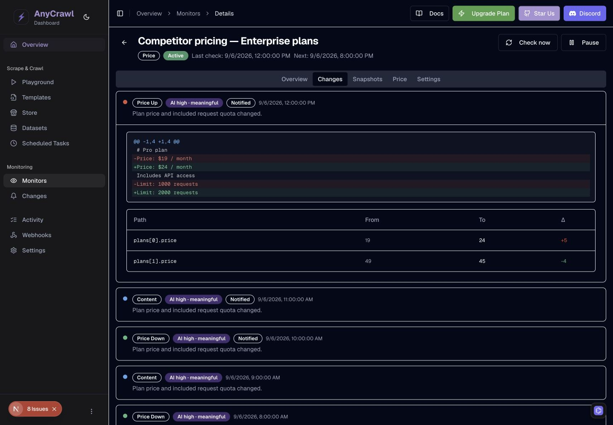
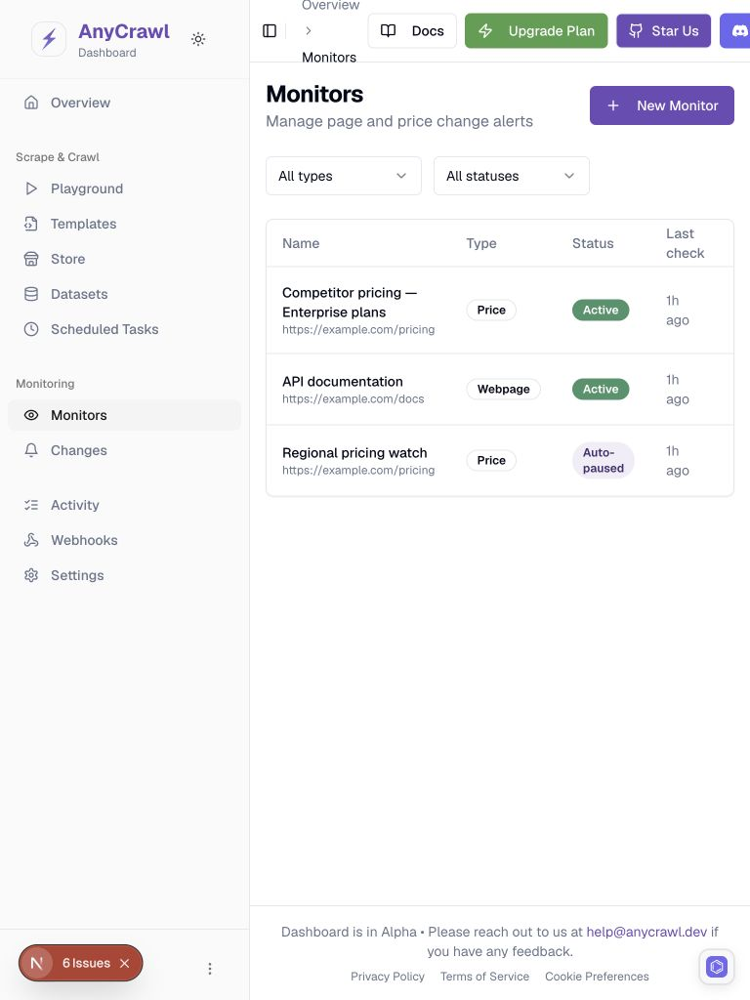
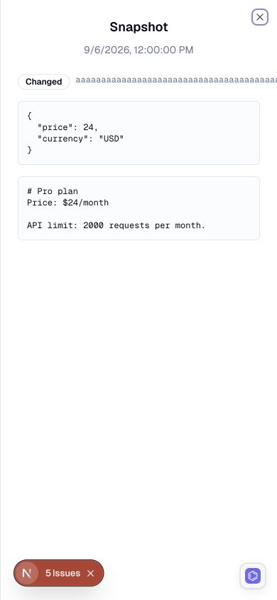
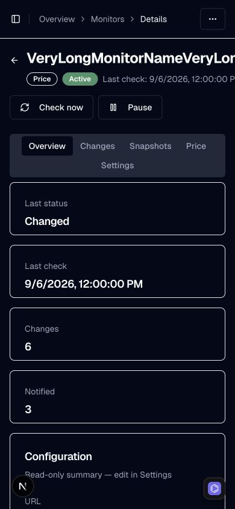
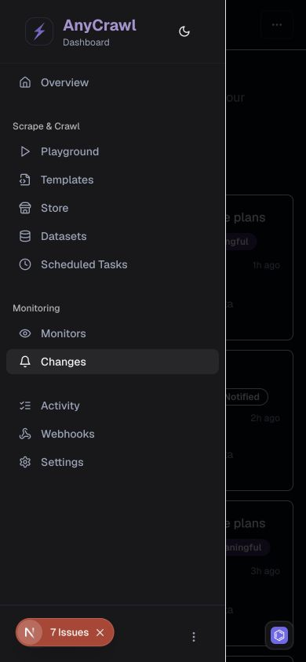

# Web Change Monitoring UI 专项审查

日期：2026-09-06。状态：**已完成下列页面、尺寸和状态的实际浏览器审查；未实施修复。**

关联文档：[实现链路审查](./web-change-monitoring-review-2026-09-06.md) · [修复计划](./web-change-monitoring-fix-plan-2026-09-06.md)。

这是对上一轮“只审实现和 UI 功能”的补充。本次实际渲染页面、切换主题/视口、操作表单和抽屉、检查键盘路径，并读取 DOM 尺寸、CSS 计算值和可访问性树。不是只根据 Tailwind 类名推测样式。

## 1. 测试环境与边界

- 使用 `AnyCrawlDashboard` 当前工作区的临时副本，包含未提交的 Changes/导航改动。基线 HEAD 为 `7ec86c11f5421116632c2bc57766def642ec23c2`。
- 临时目录：`/private/tmp/anycrawl-ui-review-yeg5bryo`。Next.js/Turbopack、React、UI 组件及已安装依赖版本保持不变。
- 用户授权使用项目现有开发登录：`ANYCRAWL_DASHBOARD_DEV_AUTH=1`。页面服务仅监听 `127.0.0.1:3011`，只读模拟 API 仅监听 `127.0.0.1:3012`，使用测试 key 和合成监控数据，没有使用真实业务凭据。
- 模拟数据覆盖 populated、empty、503 error、15 秒 delay、247 字符连续名称、snapshot detail error。临时 API 拒绝所有非 GET 方法；没有执行创建监控、保存设置、暂停、删除或发送通知。
- 浏览器：Chrome；桌面 1710×986 / 1440×1000，平板 768×1024，手机 390×844，窄屏 320×800。测试过 Light、Dark，结束时恢复 System 与默认视口。
- 原 Dashboard 源文件与准备副本时的 SHA-256 清单比较，无差异。两个临时服务均已停止。本轮新增/更新的是审查文档与截图，不是业务代码。
- 保存 **33 张原始 JPEG 截图**，未绘制标注或修改像素。截图中的 Next.js/Hexclave 开发工具按钮不计为生产 UI 缺陷。文件尺寸见 [截图清单](./assets/monitoring-ui-2026-09-06/manifest.json)。

环境准备中真实遇到并处理的问题：

| 阻塞 | 实际处理 | 对验证的影响 |
| --- | --- | --- |
| 3000 端口运行 SourceWeft，监控路由 404 | 未使用该页面作证据；建立独立临时副本与端口 | 验证当前源码版本，不代表线上版本 |
| 沙箱禁止端口监听，`listen EPERM` | 获准后重试同一本机服务 | 未扩大到公网监听 |
| Turbopack 拒绝指向项目根外的 node_modules symlink | 复制同一份已安装依赖，继续使用 Turbopack | 没有换构建器或依赖版本 |
| 文件监视器 `EMFILE`，路由未正常注册 | 临时进程设置 `WATCHPACK_POLLING=true` | 只改变开发文件发现方式；不据此评估生产加载性能 |
| dev auth 默认全零 project ID 被 SDK 拒绝 | 进程环境指定有效格式的测试 UUID | 暴露了现有 dev 默认值问题，见第 6 节 |

**真实认证、生产构建、真实 API/DB/Redis、SMTP/Webhook 和真实设备浏览器不在本次视觉运行的验证结果中。** 原报告记录的后端运行验证与 Dashboard 类型检查阻塞仍有效。页面自身的公开字体、第三方脚本及认证 SDK 加载，不等于真实业务链路验收。

## 2. 覆盖矩阵

| 页面/组件 | 实际检查的状态与尺寸 | 结果 |
| --- | --- | --- |
| Monitors 列表 | 桌面 Light/Dark、有数据；768px 平板；390px 手机；320px 空态 | 常规布局可读；平板 header 溢出、对比度及按钮名称问题 |
| 新建 Webpage/Price | 390px 第一步、Price 字段与第二步；320px 通知设置；1440px Price 向导与 URL 预填 | 普通字段/长邮箱可换行；标签、选中状态、校验与步骤焦点有缺口 |
| Monitor 详情 | 390px 普通/247 字符连续名称；Overview/Changes/Snapshots/Settings；桌面 diff/price chart | 普通标题能换行；连续标题、颜色、焦点和展开语义有问题 |
| 快照抽屉 | 390px Light 内容态、Dark 请求错误态；Escape/Close | 正文/错误与 Retry 可见；hash 横向溢出，关闭后焦点丢失 |
| 删除确认 | 390px Dark；打开、初始焦点、取消 | 说明清楚、初始焦点在 Cancel；取消后焦点未回触发按钮；未执行删除 |
| 跨监控 Changes | 1440px/390px Dark，有数据、展开；320px delay/error/empty/retry | 错误恢复有效；骨架溢出、展开语义与嵌套交互问题 |
| 导航 | 桌面侧栏、768px header、390px 手机抽屉、Tab 路径 | 手机选中路由后抽屉不关闭；面包屑跳过键盘顺序 |
| Website Monitoring 介绍页 | 1440px/390px Dark，首屏、正文结构、FAQ 展开 | 主内容可重排；共享颜色/边框问题；FAQ 能报告 expanded |
| Price Monitoring 介绍页 | 1440px/390px Dark，CTA 回跳参数、API 示例 | 布局可重排；示例缺少必填 recipients；真实登录未验收 |

表格只表示上述组合已经检查，不声称每个页面在每种主题、尺寸、状态的笛卡尔积都已验收。其余组合列入修复后的回归矩阵。

## 3. 结论与问题索引

新增 **14 项 UI/交互问题：12 项 P2、2 项 P3**。U01–U06 为颜色/样式/响应式，U07–U13 为可访问性与交互，U14 为可见页面示例的使用问题。与既有 R20–R24 有交叉，不将两份报告的数量直接相加当作去重后的总缺陷数。

| 编号 | 优先级 | 问题 | 证据 |
| --- | --- | --- | --- |
| U01 | P2 | 暗色主按钮、Active 徽章、部分 diff 数值对比度不足 | 实际 CSS 颜色与计算 |
| U02 | P3 | 重复 Tailwind preflight 覆盖暗色 border token | 实际 CSSOM 级联与截图 |
| U03 | P2 | 768px header 挤压面包屑并溢出页面 | 768→837px 实测 |
| U04 | P2 | 快照 hash 撑大手机抽屉 | 389px 可视/566px 内容 |
| U05 | P2 | 连续长名称撑大整页 | 390→3403px 实测 |
| U06 | P3 | Changes 骨架屏固定宽度导致窄屏溢出 | 320→336px 实测 |
| U07 | P2 | 表单标签与控件断开，类型选中状态未暴露 | DOM/AX 检查 |
| U08 | P2 | 返回与更多操作等图标按钮没有可访问名称 | DOM/AX 检查 |
| U09 | P2 | 面包屑没有 href，键盘导航跳过 | 实际 Tab 路径 |
| U10 | P2 | 抽屉/确认框关闭后焦点回到 body | 实际 Escape/Cancel |
| U11 | P2 | change 展开缺少状态，feed button 内嵌 link | DOM/AX 与展开操作 |
| U12 | P2 | 向导换步/失败不调整焦点与阅读位置 | 手机实际交互 |
| U13 | P2 | 手机侧栏导航后仍遮住新页面 | URL 已变，dialog 仍 open |
| U14 | P2 | Price 页面可复制示例无法通过创建校验 | 页面内容 + API schema |

### U01 — P2：文字对比度不足

计算使用浏览器 `getComputedStyle()` 的颜色，而非对 JPEG 抗锯齿像素采样。普通 12/14px 文本采用 4.5:1 的审查基准，参见 [W3C Contrast Minimum](https://www.w3.org/WAI/WCAG22/Understanding/contrast-minimum.html)。

| 实际组合 | 对比度约值 | 影响 |
| --- | --- | --- |
| Dark 主按钮：白字 / `rgb(167,145,212)` | 2.75:1 | New Monitor、Start monitoring 等启用态主操作 |
| Active 徽章：白字 / `rgb(5,150,105)` | 3.77:1 | Light/Dark 列表和详情中的小号状态文字 |
| Light 字段 diff 负 delta：`rgb(5,150,105)` / 白底 | 3.77:1 | `-4` 等下降数值 |
| Dark 字段 diff 正 delta：`rgb(220,38,38)` / `rgb(2,8,23)` | 4.14:1 | `+5` 等上涨数值 |

位置：[共享主题 tokens](../../../AnyCrawlDashboard/packages/ui/src/styles/globals.css)、[DiffJsonTable.tsx:55](../../../AnyCrawlDashboard/apps/web/components/monitors/DiffJsonTable.tsx#L55)、[列表 Active 徽章](../../../AnyCrawlDashboard/apps/web/app/dashboard/monitors/MonitorsClient.tsx#L369)。

建议：重新配对 foreground/background 与语义状态色，分别验证 Light/Dark；保持上涨/下跌的文字和符号，不仅靠红绿区分。图表坐标文字和 DiffTextView 的其他组合也纳入色板回归。

证据：[Dark 列表](./assets/monitoring-ui-2026-09-06/02-desktop-dark-list.jpg)、[Light diff](./assets/monitoring-ui-2026-09-06/14-desktop-light-diff.jpg)、[Dark diff](./assets/monitoring-ui-2026-09-06/15-desktop-dark-diff.jpg)。

### U02 — P3：全局 preflight 覆盖主题边框

Dark 根 token 为 `--border:217.2 32.6% 17.5%`，表格行实际边框却是 `rgb(229,231,235)`。读取已加载 CSSOM，顺序为：

```text
*, ::before, ::after  → rgb(229,231,235)
*                    → hsl(var(--border))
*, ::before, ::after  → rgb(229,231,235)
```

后一个通用规则把 token 规则覆盖，导致卡片、表格、弹窗在 Dark 中形成过亮的边框；显式使用 border-input 的输入框又是另一种边框，视觉不一致。

位置：[app/layout.tsx 的两份全局样式导入](../../../AnyCrawlDashboard/apps/web/app/layout.tsx)、[app/globals.css:1](../../../AnyCrawlDashboard/apps/web/app/globals.css#L1)、[共享 globals.css](../../../AnyCrawlDashboard/packages/ui/src/styles/globals.css)。

建议：修复共享 base 与应用 base 的输出顺序/重复输出，让通用组件稳定继承主题 token。该问题属于共享样式层，回归范围要包含其他 Dashboard 页面。



### U03 — P2：平板宽度 header 溢出

在 **768×1024** 下，侧栏占 256px，header 只剩 512px，但 `md:flex` 已显示 Docs、Upgrade Plan、Star Us、Discord 四个桌面操作。页面实测 `scrollWidth=837`，面包屑挤成多行，Discord 被右边界裁切。

位置：[HeaderActions.tsx:19](../../../AnyCrawlDashboard/apps/web/app/dashboard/_components/HeaderActions.tsx#L19)、[dashboard/layout.tsx](../../../AnyCrawlDashboard/apps/web/app/dashboard/layout.tsx)。

建议：按主内容实际可用宽度折叠操作，给面包屑可收缩/截断规则；不要只根据浏览器 viewport 的 md 判断四个按钮是否能放下。验收至少覆盖 768、820、1024px 和侧栏展开/折叠。



### U04 — P2：快照 hash 撑大手机抽屉

390px 视口中抽屉可视宽度 389px、内容宽度 **566px**；64 字符 hash 的宽度约 461px，`overflow-wrap:normal`。hash 与 badge 在 flex 行中不能收缩/换行，文本被裁切，并使抽屉出现横向滚动范围。内容加载成功和失败两种状态都复现。

位置：[MonitorDetailClient.tsx:1035](../../../AnyCrawlDashboard/apps/web/app/dashboard/monitors/[id]/MonitorDetailClient.tsx#L1035)。

建议：为 hash 容器增加可收缩和断行规则，或显示短 hash 并提供复制完整值；限制数据区域自己的滚动，不让标识符撑大整个抽屉。



### U05 — P2：合法长名称撑大整个详情页

测试名称为 `VeryLongMonitorName` 重复 13 次，共 **247 字符**，在 API 的 255 字符限制以内。390px 视口下 h1 宽约 3359.56px，整页 `scrollWidth=3403`；名称、状态和时间行都被横向拉开。

普通含空格的标题已检查，可正常换行；问题特指连续词、长标识符等合法输入。

位置：[MonitorDetailClient.tsx:558](../../../AnyCrawlDashboard/apps/web/app/dashboard/monitors/[id]/MonitorDetailClient.tsx#L558)。

建议：标题及其 flex ancestors 的收缩/换行策略成套处理；保留全文可访问性，不能只用页面 `overflow-x:hidden` 隐藏问题。验收包含 URL 式名称、连续 ASCII、中文和最大长度。



### U06 — P3：加载骨架不适应 320px

模拟 15 秒上游延迟，Changes 说明文字 skeleton 使用 `w-80`，自身宽 320px，加上页面左侧留白后将页面撑到 **336px**。有数据/empty/error 时并无此固定宽度问题。

位置：[ChangesClient.tsx:162](../../../AnyCrawlDashboard/apps/web/app/dashboard/monitors/changes/ChangesClient.tsx#L162)。

建议：骨架使用 max-width 和容器约束，与最终标题/说明的响应式规则一致；同时补充可感知的 loading 状态。宽表格可在自身容器横向滚动，但 loading 装饰不应制造整页滚动，参见 [W3C Reflow](https://www.w3.org/WAI/WCAG22/Understanding/reflow.html)。

证据：[320px loading](./assets/monitoring-ui-2026-09-06/20-narrow-loading-overflow.jpg)。

### U07 — P2：表单标签和选中语义缺失

实际 DOM/AX 检查确认：

- 新建向导的 Name/URL 已有 label 连接；Engine、Timezone、Check frequency 则只有显示值，没有关联的可访问名称。
- Settings 中 Name/Description/URL 等输入实测 `id=''`、`labels.length=0`、没有 aria-label。屏幕阅读器得到的是当前值，不知道字段用途。
- Extract fields 的 Array switches 显示为未命名的 switch；多个字段难以区分。
- Webpage/Price 卡片用视觉 border/ring 表示选择，但没有 radio/pressed/selected 状态。

位置：[MonitorFrequencySelect](../../../AnyCrawlDashboard/apps/web/components/monitors/MonitorFrequencySelect.tsx)、[TimezoneSelect](../../../AnyCrawlDashboard/apps/web/components/monitors/TimezoneSelect.tsx)、[ExtractSchemaBuilder](../../../AnyCrawlDashboard/apps/web/components/monitors/ExtractSchemaBuilder.tsx)、[Settings:869](../../../AnyCrawlDashboard/apps/web/app/dashboard/monitors/[id]/MonitorDetailClient.tsx#L869)。

建议：统一 label/id、aria-labelledby 与选中语义，为动态字段提供包括字段名的唯一名称。参考 [W3C Name, Role, Value](https://www.w3.org/WAI/WCAG22/Understanding/name-role-value.html)。

### U08 — P2：图标按钮没有可访问名称

列表每行 MoreHorizontal 菜单，以及新建/详情返回箭头，没有文本或 aria-label。可访问性树显示空名 button/pop up button。功能虽可点击，但使用键盘或辅助技术时难以识别目标与所属监控。

位置：[MonitorsClient.tsx:405](../../../AnyCrawlDashboard/apps/web/app/dashboard/monitors/MonitorsClient.tsx#L405)、[详情返回按钮](../../../AnyCrawlDashboard/apps/web/app/dashboard/monitors/[id]/MonitorDetailClient.tsx#L554)。

建议：提供“返回监控列表”“某监控的更多操作”等可访问名称，必要时增加一致的视觉 tooltip。已经有名称的 Toggle theme / Toggle Sidebar / More actions 不属于本问题。

### U09 — P2：面包屑只可点击，键盘跳过

`BreadcrumbLink` 是没有 href 的 `<a onClick>`。实测在手机 Changes 页，从 Toggle Sidebar 按 Tab，直接跳到 More actions，中间 Overview 面包屑被跳过。不能按普通链接进行键盘导航或打开新标签。

位置：[DynamicBreadcrumb.tsx:87](../../../AnyCrawlDashboard/apps/web/app/dashboard/_components/DynamicBreadcrumb.tsx#L87)。

建议：保留真正 href/Link 语义，再兼容现有导航加载提示；验收 Tab、Enter、修饰键点击。

### U10 — P2：抽屉和确认框关闭后丢失焦点

打开 Snapshot 时焦点进入 Close；删除确认初始焦点在 Cancel，这两点正常。但 Escape/Close 关闭快照、Cancel 关闭删除确认，等待关闭动画完成后，`document.activeElement` 都是 **BODY**，没有回到原 View/Delete monitor 按钮。

位置：[受控 Sheet:1009](../../../AnyCrawlDashboard/apps/web/app/dashboard/monitors/[id]/MonitorDetailClient.tsx#L1009)、[受控 AlertDialog:1083](../../../AnyCrawlDashboard/apps/web/app/dashboard/monitors/[id]/MonitorDetailClient.tsx#L1083)。

建议：使用对应 Trigger 或保存并恢复触发元素；列表更新后触发元素不存在时提供合理的后备焦点。验收要等退出动画完成后再判断。

### U11 — P2：变化卡片缺少展开状态且嵌套链接

详情 Changes 和全局 feed 的展开按钮都没有 `aria-expanded` / `aria-controls`。全局 feed 实测 **6 个 button 内嵌 6 个 link**，名称点击导航、其余卡片点击展开，视觉和语义上混合了两种操作；卡片也没有明确的展开/收起提示。

位置：[ChangesClient.tsx:249](../../../AnyCrawlDashboard/apps/web/app/dashboard/monitors/changes/ChangesClient.tsx#L249)、[详情 Changes:722](../../../AnyCrawlDashboard/apps/web/app/dashboard/monitors/[id]/MonitorDetailClient.tsx#L722)。

建议：监控名称使用独立链接，diff 展开使用独立按钮或可访问的 accordion，提供稳定 panel ID、expanded 状态与视觉指示。保持整行命中区域时也要避免嵌套交互控件。

证据：[手机 feed](./assets/monitoring-ui-2026-09-06/19-mobile-dark-changes.jpg)、[桌面 feed](./assets/monitoring-ui-2026-09-06/33-desktop-changes.jpg)。

### U12 — P2：向导错误和换步缺少焦点/阅读位置管理

空 Name/URL 点击 Continue，错误文字出现，但焦点仍在 Continue；Name 错误位于视口之外。输入没有 `aria-invalid` 或 `aria-describedby` 关联错误。切到第二步时，页面保留前一步底部滚动位置，焦点所在按钮已变成 Create monitor，用户看到的是通知设置中下部。

位置：[NewMonitorForm.tsx](../../../AnyCrawlDashboard/apps/web/app/dashboard/monitors/new/NewMonitorForm.tsx)。

建议：失败时聚焦第一个无效字段并关联错误；换步时聚焦当前步骤标题/首个字段，重设阅读位置，并考虑减少动态效果偏好。不要让用户依赖滚回页面上方寻找错误或新步骤内容。

证据：[校验失败](./assets/monitoring-ui-2026-09-06/07-mobile-form-validation.jpg)、[通知步骤](./assets/monitoring-ui-2026-09-06/08-mobile-notifications.jpg)。

### U13 — P2：手机侧栏选中路由后不关闭

390px 下从详情打开侧栏、点击 Changes，地址已经变成 `/dashboard/monitors/changes`，DOM h1 也是 Changes，但 Sheet 仍为 `data-state=open`，新内容继续被侧栏和遮罩覆盖。AX 中抽屉名称还是 Radix 生成标识，没有可读的导航标题；可见 Close 按钮被样式隐藏。

位置：[AppSidebar.tsx:69](../../../AnyCrawlDashboard/apps/web/app/dashboard/_components/AppSidebar.tsx#L69)、[sidebar.tsx:186](../../../AnyCrawlDashboard/apps/web/components/ui/sidebar.tsx#L186)。

建议：手机选中导航后关闭抽屉并将阅读/焦点交给新页面；补可读标题和关闭入口，保留 Escape/遮罩关闭。桌面侧栏行为保持一致且无需自动收起。



### U14 — P2：Price 页面可复制示例缺少必填字段

价格监控介绍页展示的请求包含 `channels:["email","webhook"]`，没有 `email_recipients`。根据现有 createMonitorSchema，这个请求会被拒绝；页面同时提供 Copy，使用户直接照用失败。

本项是“实际页面内容 + 源码契约”确认，没有向真实 API 执行 POST。也没有将临时模拟 API 当作真实验证器。

位置：[price-monitoring/page.tsx:80](../../../AnyCrawlDashboard/apps/web/app/price-monitoring/page.tsx#L80)、[后端 MonitorSchema:218](../../packages/libs/src/types/MonitorSchema.ts#L218)。

建议：补齐合法示例 recipients，或让示例只订阅 webhook；为页面可复制样例增加契约验证。本项与原报告 R24 交叉，地域固定宣传仍按 R15 处理。

## 4. 通过项与设计建议

### 已运行通过的检查

- 390px 常规监控标题可换行；320px 过滤器可折行；列表宽表格的滚动留在表格容器内。不能把“宽表格可横向滚动”本身误报为整页 reflow 问题。
- 普通新建表单和 320px 通知设置没有整页横向溢出；长邮箱标签能换行，未复现最初怀疑的邮箱撑宽问题。
- Changes 503 错误态有明确文字和 Retry；数据源恢复后点击 Retry 可进入正确空态。
- Monitors 空态有创建入口；Changes 空态与错误态的文案能区分。
- 快照正文/JSON 能显示，详情请求失败时有 Retry；删除确认有不可恢复说明，初始焦点在 Cancel；没有点击最终 Delete。
- 原生 FAQ 展开能在 AX 树中报告 expanded，文字在手机中正常重排。
- 直接带 query 打开新建向导，hydration 完成后 Price、URL 和频率预填正确；营销 CTA 也保留了对应登录回跳参数，但真实登录没有验收。

### 非阻塞的设计改进建议

- Feed 在手机上同时展示类型、变化类型、AI、Notified 等多个徽章，主信息层级偏平。可优先突出“哪一页、变了什么”，次要元数据收敛到一行或详情。
- 手机详情的四张统计卡逐张占满一行，阅读配置前需要较长滚动；可在保证可读性的前提下考虑紧凑布局。当前不将这一取舍判为确定缺陷。
- Website Monitoring 页面重复出现三步流程、四步流程和多组能力/范围表；可整合重复内容，减少用户到创建入口的阅读负担。
- 原报告 R23 的多价格字段被连成单条曲线，已在 [实际价格图](./assets/monitoring-ui-2026-09-06/16-desktop-price-chart.jpg) 中确认。图表应分系列、明确字段和单位，并为键盘/辅助技术提供等价数据入口；不再作为新的 UI 编号重复计数。

## 5. UI 修复验收标准

1. **响应式**：320、390、768、820、1024、1440px；正常/最长名称、hash、长 URL、长邮箱、loading/error/empty。整页无意外横向滚动，允许明确的数据容器自身滚动。
2. **主题**：Light/Dark 的普通文字达到适用对比度基准；主操作、状态、delta、图表、focus ring 和边框使用一致 token。共享 CSS 修复需回归其他页面。
3. **键盘**：面包屑可 Tab/Enter；图标按钮有名称；表单字段有标签；选择卡片有状态；展开按钮与 panel 关联。
4. **焦点**：校验失败进入首个错误；换步进入新步骤；关闭抽屉/弹窗回到触发点；手机路由选择后关闭导航。
5. **状态**：loading 可感知且不撑宽；error 有清晰重试；empty 有合理入口；重试成功恢复内容；不把开发工具/临时认证故障当生产业务状态。
6. **内容**：页面示例通过真实 API Schema 验证；宣传与 R15/R16 等实际能力一致。

这些是修复后的回归要求，不是当前全部通过的声明。参考标准是手工审查依据，不等同于 WCAG 全项认证；本轮没有运行 VoiceOver/NVDA、Safari/Firefox、真实手机或系统级减少动态效果测试。

## 6. 环境发现与尚待验收

- **DEV-01：默认开发 project ID 无法通过 SDK 校验。** [hexclave.tsx:57](../../../AnyCrawlDashboard/apps/web/hexclave.tsx#L57) 提供全零 UUID，但本轮实际 SDK 报 Invalid project ID。后续应修正开发默认值并测试无真实凭据的启动路径。生产分支未受这个测试默认值影响。
- dev auth 只覆写服务端 getUser；客户端认证 hook 仍没有真实会话，营销 CTA 会进入 `/login?after_auth_return_to=...`。因此没有验证真实登录、用户菜单/账户资料、登录后的自动回跳。
- 开发环境观察到 Radix ID 的 hydration mismatch，以及无标题的 sidebar dialog 警告。sidebar 缺少可读标题已归入 U13；其余 hydration 问题需在干净生产构建、真实认证和排除浏览器扩展影响后定位，未直接归因于某个业务组件。
- 部分首次页面导航等待超时，随后页面完成开发编译并可正常访问。这些冷编译等待不作为生产性能结论。
- 未重新运行上一轮已通过的 56 个后端/组件测试；本轮没有业务代码变更。Dashboard 的既有类型检查阻塞和真实多进程链路缺口仍按主报告处理。

## 7. 截图索引

全部截图为合成数据；原始文件和宽高见 [manifest.json](./assets/monitoring-ui-2026-09-06/manifest.json)。

| 场景 | 截图 |
| --- | --- |
| 桌面列表 | [Dark](./assets/monitoring-ui-2026-09-06/02-desktop-dark-list.jpg)、[Light](./assets/monitoring-ui-2026-09-06/03-desktop-light-list.jpg) |
| 响应式列表 | [平板溢出](./assets/monitoring-ui-2026-09-06/04-tablet-light-list.jpg)、[手机列表](./assets/monitoring-ui-2026-09-06/05-mobile-light-list.jpg) |
| 新建与通知 | [手机向导](./assets/monitoring-ui-2026-09-06/06-mobile-new-monitor.jpg)、[校验](./assets/monitoring-ui-2026-09-06/07-mobile-form-validation.jpg)、[通知步骤](./assets/monitoring-ui-2026-09-06/08-mobile-notifications.jpg)、[长邮箱](./assets/monitoring-ui-2026-09-06/09-mobile-long-recipient.jpg)、[320px 通知](./assets/monitoring-ui-2026-09-06/10-narrow-notification-form.jpg)、[桌面 Price 向导](./assets/monitoring-ui-2026-09-06/32-desktop-price-wizard.jpg) |
| 详情与抽屉 | [Overview](./assets/monitoring-ui-2026-09-06/11-mobile-detail-overview.jpg)、[hash 溢出](./assets/monitoring-ui-2026-09-06/12-mobile-snapshot-overflow.jpg)、[长标题](./assets/monitoring-ui-2026-09-06/24-mobile-long-title-overflow.jpg)、[快照错误](./assets/monitoring-ui-2026-09-06/25-mobile-snapshot-error.jpg) |
| Diff / Price / Settings | [手机 diff](./assets/monitoring-ui-2026-09-06/13-mobile-light-diff.jpg)、[Light diff](./assets/monitoring-ui-2026-09-06/14-desktop-light-diff.jpg)、[Dark diff](./assets/monitoring-ui-2026-09-06/15-desktop-dark-diff.jpg)、[价格图](./assets/monitoring-ui-2026-09-06/16-desktop-price-chart.jpg)、[设置](./assets/monitoring-ui-2026-09-06/17-mobile-dark-settings.jpg)、[删除确认](./assets/monitoring-ui-2026-09-06/18-mobile-delete-dialog.jpg) |
| Feed 与状态 | [手机 feed](./assets/monitoring-ui-2026-09-06/19-mobile-dark-changes.jpg)、[loading](./assets/monitoring-ui-2026-09-06/20-narrow-loading-overflow.jpg)、[error](./assets/monitoring-ui-2026-09-06/21-narrow-error-state.jpg)、[empty changes](./assets/monitoring-ui-2026-09-06/22-narrow-empty-changes.jpg)、[empty monitors](./assets/monitoring-ui-2026-09-06/23-narrow-empty-monitors.jpg)、[桌面 feed](./assets/monitoring-ui-2026-09-06/33-desktop-changes.jpg) |
| 手机导航 | [路由已变，抽屉未关](./assets/monitoring-ui-2026-09-06/26-mobile-sidebar-after-navigation.jpg) |
| 介绍页 | [Website 桌面](./assets/monitoring-ui-2026-09-06/27-desktop-website-monitoring.jpg)、[Website 手机](./assets/monitoring-ui-2026-09-06/28-mobile-website-monitoring.jpg)、[FAQ](./assets/monitoring-ui-2026-09-06/29-mobile-faq-expanded.jpg)、[Price 手机](./assets/monitoring-ui-2026-09-06/30-mobile-price-monitoring.jpg)、[Price 桌面](./assets/monitoring-ui-2026-09-06/31-desktop-price-monitoring.jpg) |

## 8. Docs consulted

- [Dashboard AGENTS.md](../../../AnyCrawlDashboard/AGENTS.md)：使用既有设计 token、组件复用和响应式一致性要求。
- [主审查报告](./web-change-monitoring-review-2026-09-06.md)、[Monitor Dashboard 接入指南](../api/monitors-dashboard-guide.md)、[Monitor API](../api/monitors-api.md)。
- [Dashboard 项目结构](../../../AnyCrawlDashboard/docs/PROJECT_STRUCTURE.md)、[安装指南](../../../AnyCrawlDashboard/docs/INSTALLATION_GUIDE.md)。
- [W3C Contrast Minimum](https://www.w3.org/WAI/WCAG22/Understanding/contrast-minimum.html)、[Reflow](https://www.w3.org/WAI/WCAG22/Understanding/reflow.html)、[Name, Role, Value](https://www.w3.org/WAI/WCAG22/Understanding/name-role-value.html)、[Target Size Minimum](https://www.w3.org/WAI/WCAG22/Understanding/target-size-minimum.html)。本轮没有把尺寸小于 24px 的所有图标都直接判为违规，仍需考虑间距等例外。
